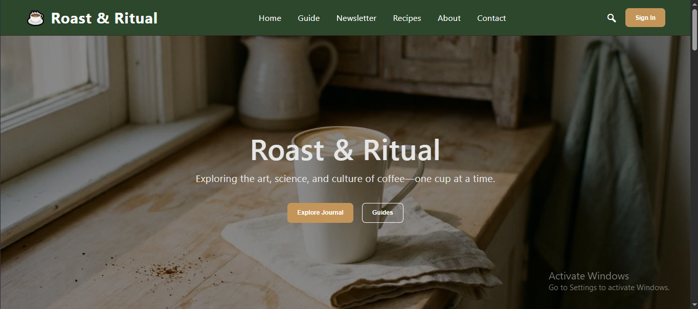
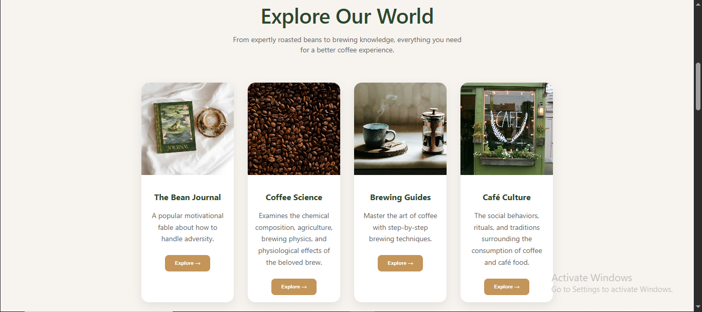
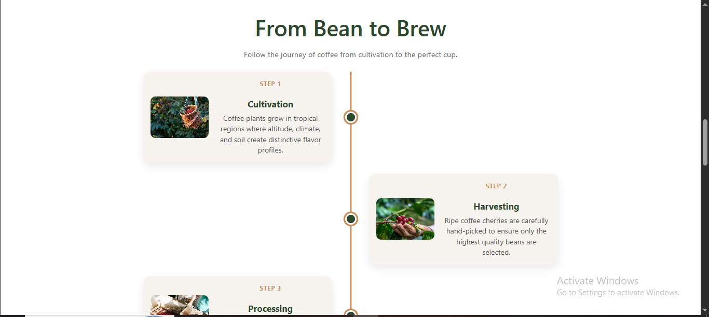
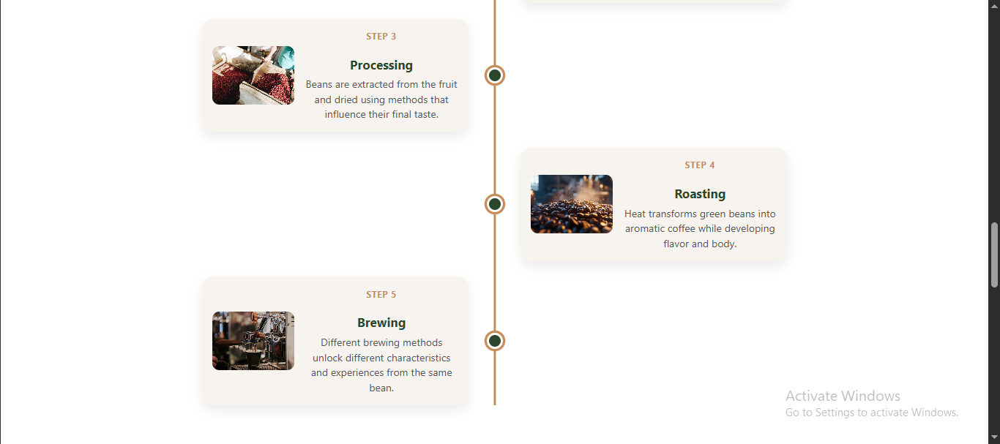
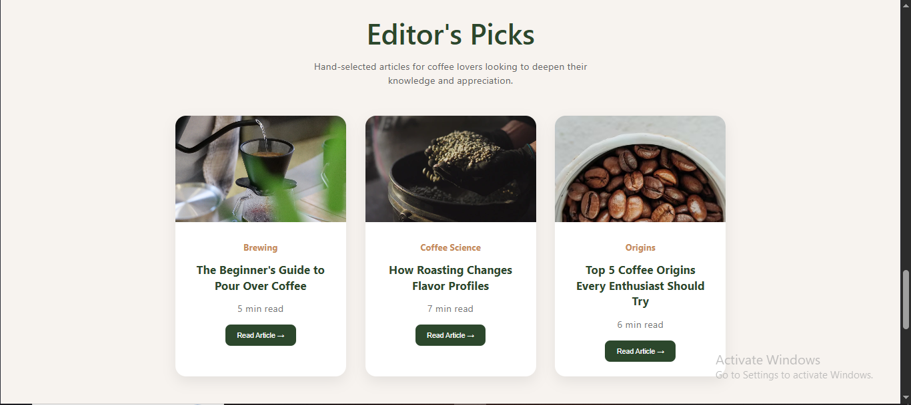
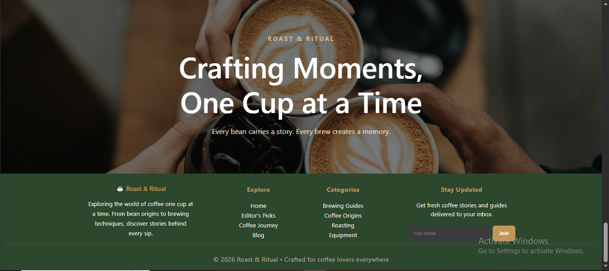

# Roast & Ritual

A modern coffee-inspired blog built with React and Vite.

Designed to capture the atmosphere, rituals, and experiences surrounding coffee culture through a clean and immersive interface.

## Features

- Responsive navigation bar
- Full-screen hero section
- Explore Our World content cards
- Bean-to-Brew timeline
- Featured editor articles
- Parallax-style image banner
- Custom coffee-inspired color palette
- Responsive layout

## Built With

- React
- Vite
- JavaScript
- CSS

## Project Goal

This project was created to practice React fundamentals, component-based architecture, styling, layout design, and modern frontend development while building a visually appealing blog experience.

(Images used for educational purposes)

## Author
Built by Sushma Rai
